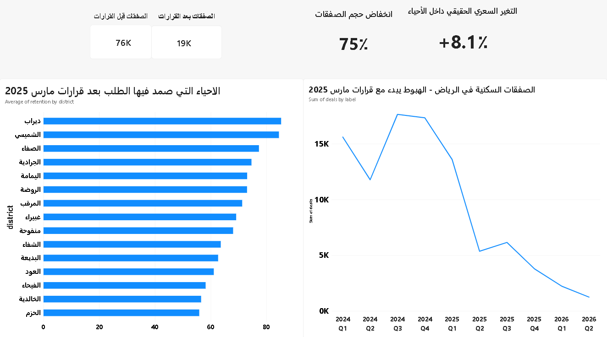

# Riyadh Real Estate: Measuring the Impact of the March 2025 Market Regulations

**How did the March 2025 regulatory decisions reshape Riyadh's residential property market — and which districts held their demand?**

An analysis of 625,000 open-data property transactions, narrowed to 94,724 clean Riyadh residential deals across 10 quarters.

---

## الخلاصة بالعربية

في ٢٩ مارس ٢٠٢٥ صدرت حزمة قرارات لتنظيم السوق العقارية في الرياض. يقيس هذا المشروع أثرها باستخدام بيانات الصفقات العقارية المفتوحة من وزارة العدل.

**النتيجة:** القرارات **جمّدت** السوق ولم تُنهِه. انهارت أحجام التداول ٧٥٪ بينما ارتفعت الأسعار داخل الأحياء ٨٪ — أي أن البائعين انسحبوا وانتظروا بدل أن يبيعوا بخسارة. والنشاط المتبقي تركّز في الأحياء المبنية القديمة وسط الرياض وجنوبها، حيث الطلب سكني حقيقي، لا في مخططات الأطراف ولا في شمال المدينة حيث كانت المضاربة.

**أهم درس منهجي:** قراءة سطحية للبيانات تُظهر ارتفاع الأسعار ٣٦٪. الرقم الحقيقي ٨٪ فقط — والباقي أثر تغيّر تركيبة ما يُباع، لا ارتفاعاً فعلياً.

---

## Dashboard

---

## Key Findings

### 1. Transaction volume collapsed by 75%

| Period | Transactions |
|---|---|
| Five quarters before the decisions (2024 Q1 – 2025 Q1) | 75,925 |
| Five quarters after (2025 Q2 – 2026 Q2) | 18,799 |

The break is sharp and precisely timed. The decisions were issued on 29 March 2025 — the final days of Q1 — and volume fell 61% in the very next quarter, from 13,580 to 5,360.

The effect was not a one-off shock. Volume kept declining for four consecutive quarters, ending 92% below the 2024 Q1 level.

### 2. Prices did not fall — the market froze

This is where a naive reading goes wrong.

| Measure | Result |
|---|---|
| Citywide median price per m² | 1,900 → 2,592 SAR (**+36% — misleading**) |
| **Median change within each district** | **+8.1%** |
| Districts with rising prices | 70 |
| Districts with falling prices | 34 |

The citywide figure compares two different mixes of property. Large land plots (low price per m²) stopped trading while smaller built units (high price per m²) kept trading — so the median rose without any individual property gaining value. Comparing each district against itself removes the mix effect and gives the real figure: **+8.1%**.

**Interpretation:** sellers withdrew and waited rather than selling at a loss. Volume collapsed; value did not.

### 3. Old, built-up districts held their demand

The regulations acted as a **natural experiment** — a single external shock, on a known date, hitting every district simultaneously. Districts that retained activity afterwards were those with genuine end-user demand rather than speculation.

**Highest retention:** Dirab · Al-Shumaysi · Al-Safa · Al-Jaradiyah · Al-Yamamah · Al-Rawdah · Al-Murabba · Ghubairah · Manfouha · Al-Shifa · Al-Badiah — all central and southern Riyadh.

**Lowest retention:** Al-Sahab (0.4%) · Sidrah (1.4%) · Al-Wisam (2.8%) · Al-Nathim (4.2%) · Al-Muhammadiyah · Al-Nakheel · Hittin · Al-Malqa · Al-Aqiq.

**Not one expensive northern district appears among the survivors.**

Al-Nathim is the starkest case: 11,701 transactions before, 493 after — a 96% loss in what had been Riyadh's most actively traded district.

### 4. A hypothesis that failed

The initial hypothesis was that expensive districts collapsed while cheap ones survived. The data rejected it:

- **Expensive and collapsed:** Al-Muhammadiyah (9,845) · Al-Malqa (9,112) · Al-Nakheel (8,809) · Hittin (8,791)
- **Cheap and collapsed:** Al-Nukhbah (523) · Al-Rabiah (775) · Al-Sahab (1,300) · Al-Nathim (1,300)

Price alone does not separate survivors from casualties.

### 5. Plot size separates them better

| Group | Median area | Median price |
|---|---|---|
| Highest retention | 180 m² | 2,673 SAR/m² |
| Lowest retention | 300 m² | 4,352 SAR/m² |

Collapsed districts trade plots 67% larger. The likely explanation is that **land speculation stopped while built housing kept trading**.

**This remains an inference, not a proven fact.** The dataset has no property-type column, so area serves only as an indirect proxy.

---

## Method

1. **Merge** — 12 quarterly CSV files from the Saudi Open Data Portal (Ministry of Justice)
2. **Clean** — type conversion, deduplication, outlier trimming, district extraction
3. **Scope** — Riyadh city, residential only, single-property transactions
4. **Split** — five quarters before the 29 March 2025 cut-off, five quarters after
5. **Analyse** — retention rate, within-district price change, area comparison

Every cleaning decision is documented with its rationale in [`cleaning_notes.md`](cleaning_notes.md).

### Notable data issues found

- **Two duplicate files.** `2024 p11` and `2024 p22` were duplicate downloads. Undetected, they would have inflated 2024 by 107,000 rows and shown a fictitious 43% market collapse instead of the real 19% decline.
- **Means lie without context.** Al-Bat'ha topped the price ranking at 16,858 SAR/m² from 14 transactions, against a median of 5,265. Al-Jami'ah showed exactly 10,000 SAR/m² — from a single transaction.
- **Raw district count was inflated.** The data yielded 196 districts, well above published counts for Riyadh (130–160). Filtering removed rare entries and non-districts such as "other", "outside district boundaries", and the airport.

### External validation

Published market reporting puts Riyadh at 2,597 transactions in Q1 2026 against 14,578 in Q1 2025. This analysis independently produces 2,232 and 13,580 — the gap reflects the residential/single-property filters, while the pattern and ratio match.

---

## Data

**Source:** Real estate transactions, Saudi Open Data Portal (Ministry of Justice)
**Coverage:** 2024 (full) · 2025 (full) · 2026 Q1–Q2
**Raw:** ~625,000 rows, all Saudi regions
**Final:** 94,724 transactions · 106 districts · 10 quarters

### Cleaning pipeline

| Stage | Rows |
|---|---|
| Merged raw files | 625,504 |
| After deduplication and null dates | 518,134 |
| Riyadh + residential | 103,134 |
| Single property + 1st–99th percentile trim | 100,018 |
| Districts with ≥100 transactions | 97,383 |
| **Non-district entries removed** | **94,724** |

---

## Limitations

- **No property-type column.** The land-versus-built explanation rests on median area as a proxy. It is plausible, not proven.
- **Outliers were trimmed citywide, not per district.** A 13,000 SAR/m² sale is normal in Al-Malqa and impossible in Al-Rabiah, so some local outliers survive in cheaper districts.
- **2026 Q2 could not be externally verified** and may be incomplete if the source publishes in stages.
- **Districts under 100 transactions were excluded.** Results describe 106 districts, not all of Riyadh.
- **Registered transactions only.**
- **Historical data does not forecast.** Nothing here predicts future prices.

---

## Repository

| File | Contents |
|---|---|
| `01_explore.ipynb` | Merging, cleaning, type conversion |
| `02_analysis.ipynb` | Period split, retention, price analysis |
| `cleaning_notes.md` | Every cleaning decision and its rationale |
| `riyadh_clean.csv` | Cleaned dataset (94,724 rows) |
| `district_summary.csv` | Per-district metrics |
| `quarterly_summary.csv` | Quarterly time series |
| `dashboard.pbix` | Power BI dashboard |

## Tools

Python (pandas) · Jupyter · Power BI
